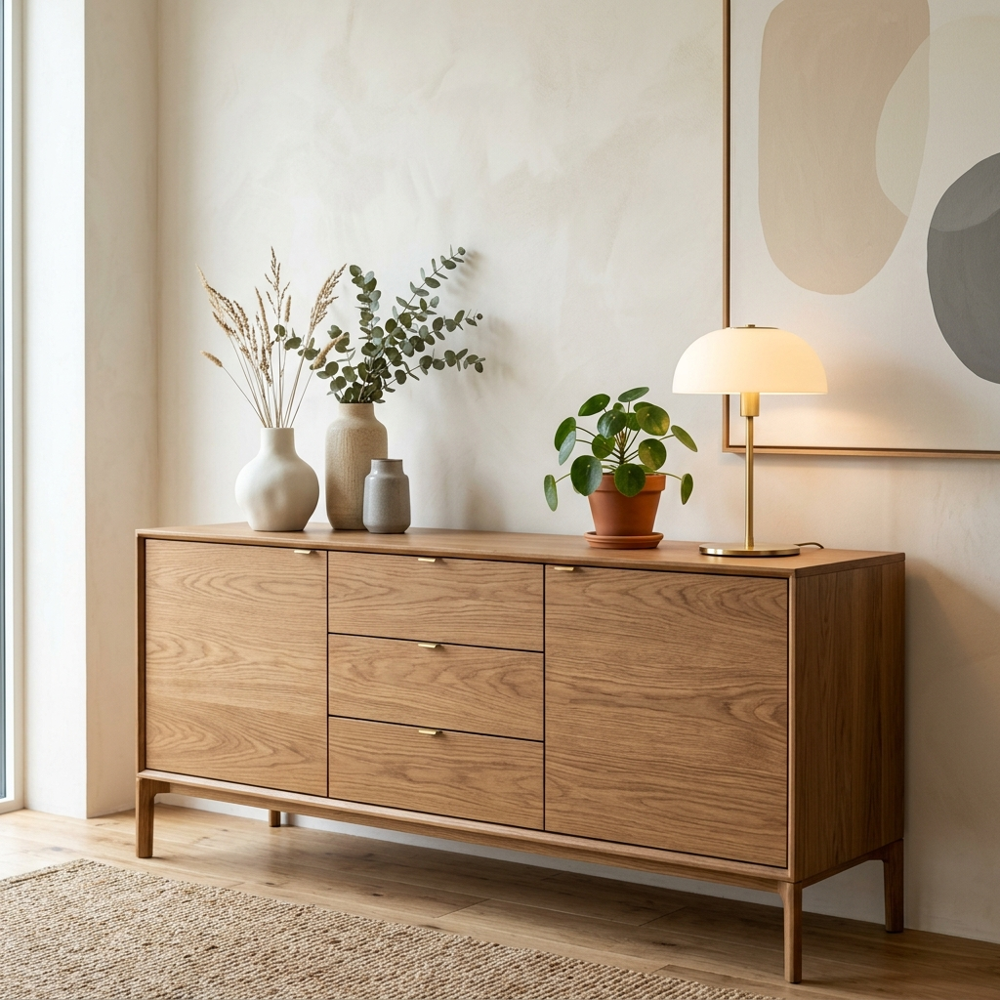

# Furniqlo Furniture Store

Elevate your living space with our premium, high-quality furniture. Furniqlo is a modern e-commerce landing page designed for a luxurious and seamless shopping experience.



## ✨ Features

- **Premium Design**: Elegant serif typography and minimalist layouts.
- **Interactive UX**: Parallax scrolling effects and magnetic buttons.
- **Shopping Cart**: Fully functional cart sidebar with item management.
- **Quick View**: Detailed product modals for a closer look.
- **Responsive**: Perfectly optimized for mobile, tablet, and desktop.
- **Simulated Checkout**: A multi-step checkout flow with success feedback.

## 🛠️ Technology Stack

- **React 19**
- **TypeScript**
- **Vite**
- **Framer Motion** (Animations)
- **Lucide React** (Icons)
- **Vanilla CSS**

## 🚀 Getting Started

1. **Clone the repository**
   ```bash
   git clone https://github.com/Rudraptl16/Furniqlo-Store.git
   ```

2. **Install dependencies**
   ```bash
   npm install
   ```

3. **Run the development server**
   ```bash
   npm run dev
   ```

## 📸 Preview

- [x] Hero Section
- [x] Featured Products
- [x] Product Grid with Filters
- [x] Animated Mobile Menu
- [x] Checkout Success Notification

---
Developed by [Rudraptl16](https://github.com/Rudraptl16)
